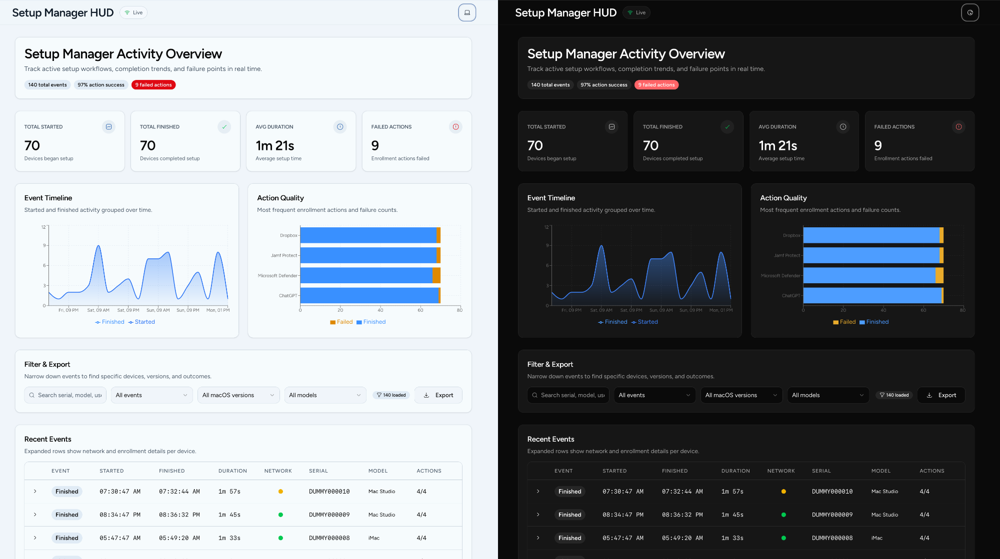

# Setup Manager HUD

A Cloudflare Workers-hosted dashboard for [Setup Manager](https://github.com/nicknameislink/setupmanager) that shows macOS enrollment events in real time.

Setup Manager sends webhook events during provisioning. This project stores those events in Workers KV, streams them over WebSockets, and presents them in a dashboard with KPIs, charts, and event history.



## Why This Exists

Setup Manager already emits useful lifecycle events. Setup Manager HUD gives you a simple way to:

- watch enrollments live without refreshing
- confirm that devices are starting and finishing as expected
- spot failed enrollment actions quickly
- review recent device activity, timings, and trends

This project is designed to run on Cloudflare Workers. A deployment is not complete until all of the following are true:

- the Worker is deployed
- a `WEBHOOKS` KV binding exists
- a `WEBHOOK_TOKEN` secret exists
- Setup Manager is configured to send that same token in `Authorization`
- Cloudflare Access is configured if the dashboard should not be public

## Deployment Overview

There are two practical ways to deploy this project:

1. `Deploy to Cloudflare Workers` button
   Best for Jamf admins who want the fastest path to a working Cloudflare-hosted HUD.
2. Manual Wrangler deploy
   Best if you want to manage the repo and deployment from the command line.

There is also a GitHub Actions workflow, but that is an advanced maintenance option. It deploys code only. It does not create Worker runtime secrets or bindings for you.

## Recommended Path: Deploy Button

Use the deploy button if you want the quickest Cloudflare-first setup.

[](https://deploy.workers.cloudflare.com/?url=https://github.com/motionbug/setupmanagerhud)

What it does:

1. forks this repo to your GitHub account
2. creates a Cloudflare Worker in your account
3. wires up a GitHub-based deployment flow for that fork

What it does not do:

- create the `WEBHOOKS` KV binding
- create the `WEBHOOK_TOKEN` secret
- configure Cloudflare Access
- configure Setup Manager

After the deploy button flow finishes, continue with the required setup checklist below.

## Manual Path: Wrangler

Use this path if you prefer to deploy directly from the command line.

Prerequisites:

- [Node.js](https://nodejs.org/) 20 or later
- a [Cloudflare account](https://dash.cloudflare.com/sign-up)
- [Wrangler CLI](https://developers.cloudflare.com/workers/wrangler/install-and-update/)

```bash
git clone https://github.com/motionbug/setupmanagerhud.git
cd setupmanagerhud
npm install
npx wrangler login
npm run build
npx wrangler deploy
```

This creates the Worker code deployment, but it is still not ready to receive Setup Manager events until you complete the checklist below.

## Required Setup Checklist

Complete these steps in order after any first deployment.

### 1. Create and bind Workers KV

This app stores webhook events in Workers KV. Without the binding, the Worker cannot persist events.

Cloudflare dashboard path:

1. go to **Workers & Pages -> KV**
2. create a namespace
3. name it `WEBHOOKS`
4. open your Worker
5. go to **Settings -> Bindings**
6. add a **KV Namespace** binding named exactly `WEBHOOKS`
7. save and deploy

If you want the binding managed in code for repeatable deploys, use Wrangler and then commit the KV namespace ID into `wrangler.toml`:

```bash
npx wrangler kv namespace create WEBHOOKS
```

Then uncomment and fill in the `[[kv_namespaces]]` section in [wrangler.toml](/Users/rob.potvin/Git/setupmanagerHUD/wrangler.toml).

### 2. Generate a webhook token

Generate a shared token that Setup Manager and the Worker will both use.

```bash
openssl rand -hex 24
```

That produces a random token you can paste into Cloudflare and into your Setup Manager configuration.

### 3. Add `WEBHOOK_TOKEN` to the Worker

The webhook endpoint is secure-by-default. It rejects requests unless the Worker has a secret named `WEBHOOK_TOKEN`.

Cloudflare dashboard path:

1. open **Workers & Pages**
2. open your Worker
3. go to **Settings -> Variables and Secrets**
4. add a **Secret**
5. name it `WEBHOOK_TOKEN`
6. paste the token you generated
7. click **Deploy**

Wrangler option:

```bash
npx wrangler secret put WEBHOOK_TOKEN
```

### 4. Configure Setup Manager in Jamf Pro

Setup Manager must send the same token in the `Authorization` header. Use the token-authenticated `dict` format for each webhook.

```xml
<key>webhooks</key>
<dict>
  <key>finished</key>
  <dict>
    <key>token</key>
    <string>your-shared-webhook-token</string>
    <key>url</key>
    <string>https://your-worker.your-subdomain.workers.dev/webhook</string>
  </dict>
  <key>started</key>
  <dict>
    <key>token</key>
    <string>your-shared-webhook-token</string>
    <key>url</key>
    <string>https://your-worker.your-subdomain.workers.dev/webhook</string>
  </dict>
</dict>
```

Behavior:

- Setup Manager sends `Authorization: <your-shared-webhook-token>`
- the Worker compares that value to `WEBHOOK_TOKEN`
- if they match, the event is accepted and stored

### 5. Protect the dashboard with Cloudflare Access

Webhook token auth protects `/webhook`. It does not protect the dashboard itself.

If the dashboard should not be public, configure Cloudflare Access for the Worker and set the Worker vars that enable JWT verification.

Cloudflare Access setup:

1. enable **Zero Trust** in Cloudflare
2. create an **Access Application** for your Worker hostname
3. create an allow policy for the people who should view the dashboard
4. create a bypass policy for `/webhook`
5. place the bypass policy above the allow policy

Then configure these Worker vars:

```toml
[vars]
CF_ACCESS_AUD = "paste-your-audience-tag-here"
CF_ACCESS_TEAM_DOMAIN = "your-team.cloudflareaccess.com"
```

These values are documented in [wrangler.toml](/Users/rob.potvin/Git/setupmanagerHUD/wrangler.toml). If they are not set, the Worker will not enforce Cloudflare Access JWT validation.

### 6. Optional defense in depth: rate-limit `/webhook`

Webhook token auth is the baseline requirement. Rate limiting is still useful as defense in depth.

Suggested Cloudflare WAF rule:

- path equals `/webhook`
- start around `30 requests per minute per IP`
- raise the threshold if many devices enroll behind the same NAT or VPN

## Verify the Setup

Use these checks after deployment and configuration.

### Expected webhook responses

- correct token and valid payload -> `200`
- missing token or wrong token -> `401`
- missing `WEBHOOK_TOKEN` on the Worker -> `503`

### Sample `curl` test

```bash
curl -i -X POST https://your-worker.your-subdomain.workers.dev/webhook \
  -H "Authorization: your-shared-webhook-token" \
  -H "Content-Type: application/json" \
  -d '{
    "name": "Started",
    "event": "com.jamf.setupmanager.started",
    "timestamp": "'$(date -u +%Y-%m-%dT%H:%M:%SZ)'",
    "started": "'$(date -u +%Y-%m-%dT%H:%M:%SZ)'",
    "modelName": "MacBook Pro",
    "modelIdentifier": "Mac15,3",
    "macOSBuild": "24A335",
    "macOSVersion": "15.0",
    "serialNumber": "TESTSERIAL01",
    "setupManagerVersion": "2.0.0"
  }'
```

### Dashboard verification

If Cloudflare Access is enabled:

- visiting `/` should require login
- `/ws`, `/api/events`, `/api/stats`, and `/api/health` should not be publicly readable without Access
- `/webhook` should remain reachable for Setup Manager, but only with the correct token

## Sending Test Data

This repo includes a script that sends dummy webhook events so you can verify the dashboard end to end.

```bash
WORKER_URL=https://your-worker.your-subdomain.workers.dev \
WEBHOOK_TOKEN=your-shared-webhook-token \
node scripts/send-dummy-events.js
```

The script sends realistic started and finished events so you can confirm that:

- the Worker accepts authenticated webhook traffic
- events appear in the dashboard
- charts and KPIs populate

If you want to remove test data, delete the matching entries from the `WEBHOOKS` KV namespace in the Cloudflare dashboard.

## Advanced Option: GitHub Actions

This repo includes [.github/workflows/deploy.yml](/Users/rob.potvin/Git/setupmanagerHUD/.github/workflows/deploy.yml), which can deploy the Worker from a fork.

Use this option if you want a repeatable fork-based deploy workflow. It is not the simplest first-time setup path.

What GitHub Actions does:

- checks out the repo
- installs dependencies
- builds the frontend
- deploys the Worker using Wrangler

What GitHub Actions does not do:

- create the `WEBHOOKS` KV binding
- create `WEBHOOK_TOKEN`
- configure Cloudflare Access
- configure Setup Manager

To use it:

1. fork this repo
2. create a Cloudflare API token with Workers deploy access
3. find your Cloudflare Account ID
4. add these GitHub repository secrets to your fork:
   - `CLOUDFLARE_API_TOKEN`
   - `CLOUDFLARE_ACCOUNT_ID`
5. if you want KV managed by code, uncomment the `[[kv_namespaces]]` block in `wrangler.toml` and commit the real namespace ID
6. run the workflow from the **Actions** tab
7. still complete the same Worker setup checklist above

Important:

- GitHub repository secrets are for the GitHub workflow only
- they do not become Worker runtime secrets automatically
- you must still add `WEBHOOK_TOKEN` inside the Cloudflare Worker settings

## Local Development

For local frontend-only work:

```bash
npm run dev
```

For local Worker development:

```bash
npm run dev:worker
```

If you run the Worker locally, create a `.dev.vars` file with at least:

```bash
WEBHOOK_TOKEN=your-local-test-token
```

Cloudflare Access is normally not active during local development.

## How It Works

The runtime flow is:

1. Setup Manager sends a signed-by-token webhook to `/webhook`
2. the Worker validates the token and payload
3. the Worker stores the event in Workers KV
4. the Durable Object broadcasts new events to connected dashboards
5. the dashboard reads history and live updates from the Worker

Main platform pieces:

- **Cloudflare Workers** for HTTP routing and static asset serving
- **Workers KV** for event persistence
- **Durable Objects** for WebSocket fan-out
- **Cloudflare Access** for dashboard protection
- **React** for the UI

## Contributing

Contributions are welcome. Please open an issue first if you want to propose a significant change.

## License

[MIT](LICENSE)
